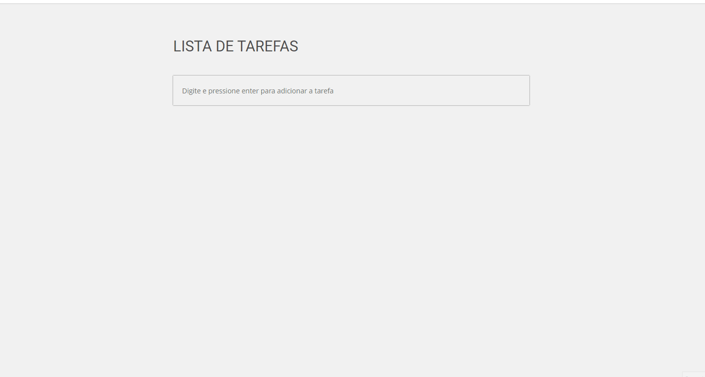

<h1 align="center">To do Tarefas</h1> 
  
Aplicação todolist (Lista de tarefas)

Depois de estudos e video aulas fiz o meu ToDo Tarefas hahaha, aprendi e fortaleceu bastante o conhecimento com funções, localstorage e javascript como um todo.

<h1 align="center">
  
</h1>

<h4 align="center"> 
	🚧  To do Tarefas 📓 Pronto para apresentação  🚧
</h4>
  
